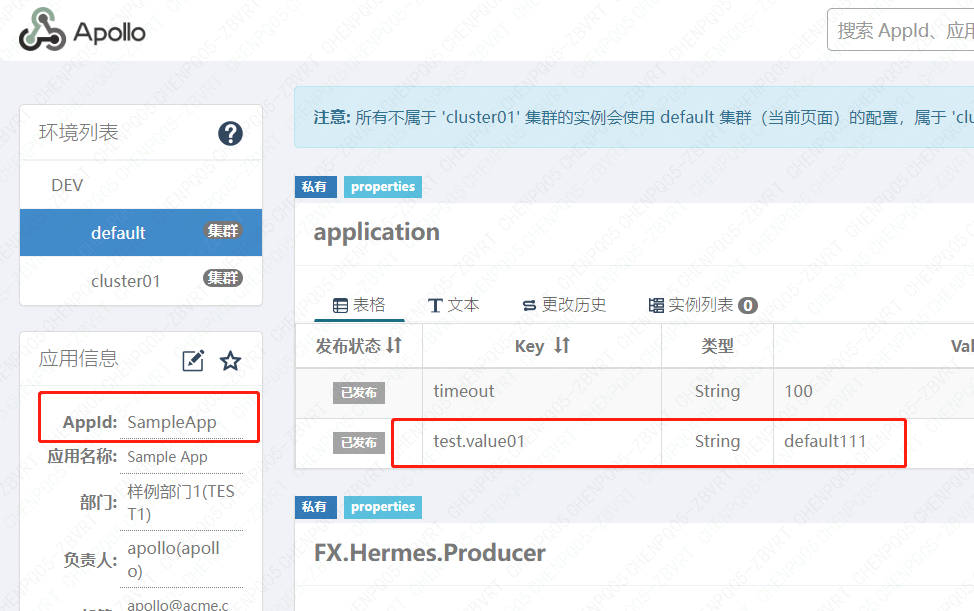

## 官方文档
https://www.apolloconfig.com/#/zh/deployment/quick-start

## spring-boot整合方式
1、导入依赖
```xml
    <dependency>
      <groupId>com.ctrip.framework.apollo</groupId>
      <artifactId>apollo-client</artifactId>
      <version>2.1.0</version>
    </dependency>
```
2、添加配置文件
```yaml
app:
  # 应用id
  id: SampleApp
apollo:
  # 服务端地址
  meta: http://127.0.0.1:8080
  bootstrap:
    enabled: true
    eagerLoad:
      enabled: true
```
3、启动类Apollo01Application.java添加@EnableApolloConfig

4、apollo服务端新增配置项：test.value01


5、代码获取配置项
```java
  @Value("${test.value01}")
  private String value01;
```

## 使用方式补充
1、只有使用分布式部署方式才能在配置文件中配置环境。web管理页面无法新建环境，Quick Start方式部署也不支持配置环境。

2、如果apollo服务端有多环境，可以加上JVM参数-Denv指定环境。例如：
```shell
java -jar test.jar -Denv=DEV
```


