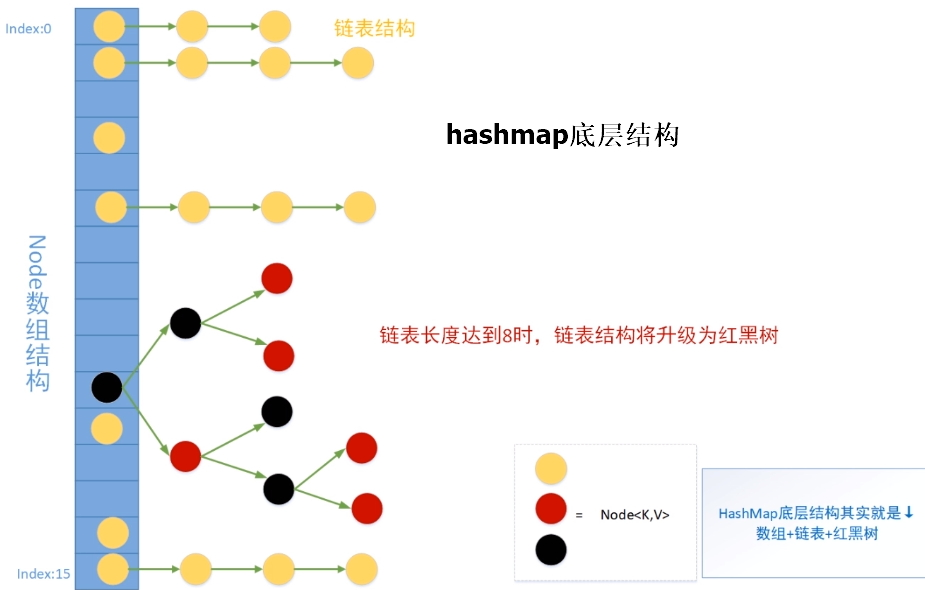
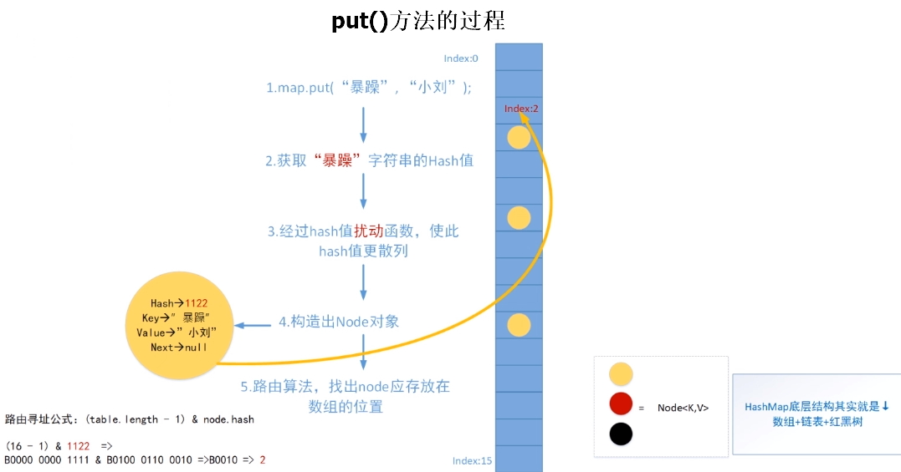
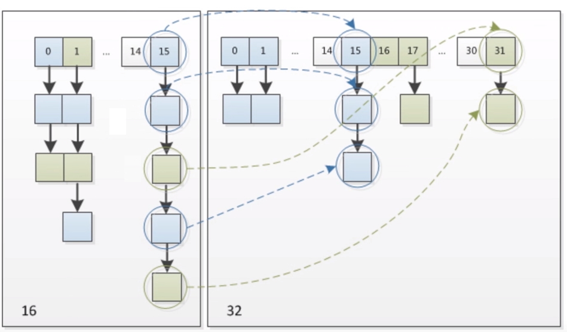

# hashmap原理
数组是连续内存 
链表长度超过8个，转换为红黑树
## hashmap底层结构

## put方法的过程

### 第5点路由寻址公式解读 
1、数组长度是2的n次方，2的n次方 - 1 转为二进制，地位一定全是1  
2、(table.length - 1) & node.hash 的结果是高位全为0，地位保持不变  
3、如果table.length - 1 的二进制位数与hash值的二进制位数相同，则(table.length - 1) & node.hash是node.hash本身，也可以说node.hash就是槽位的下标

## hashmap源码 HashMap源码.java
### 数组扩容，链表的处理逻辑
key的路由算法是 node.hash & (table.length - 1)  
假设原数组长度是16，根据路由算法 node.hash & 15，换算为二进制 xxxxx & 1111，可以得出table[15]槽位链表Node的hash值后四位一定1111，即table[15]槽位链表Node的hash值是xxxx1111   
扩容后数组长度是32，根据key的路由算法 node.hash & 31，hash值是xxxx1111的node将分布在table[15]、table[32]这两个槽位中，具体在哪个槽位取决于第5位二进制是0还是1   
table[15]node的hash值是xxx01111   
table[32]node的hash值是xxx11111   

