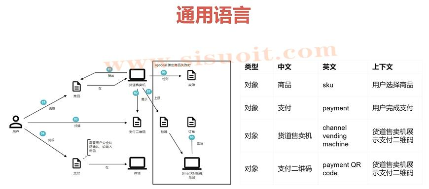

DDD核心思想：
    1、模型分解
        领域划分、界限上下文
    2、模型驱动设计
        通过分层架构隔离领域层、仔细选择模型和设计方案等措施保持实现与模型的一致

模型是对领域的抽象，建模是针对特定问题建立领域的合理模型
复杂性来源于业务本身的复杂性和设计引入的额外复杂性
领域驱动设计通过分解模型和模型驱动设计控制复杂性

建模和设计的整体流程:
---------- 用户故事 ---------->
    -------- 建立通用语言 ---->
        ------ 战略设计 ------>
            ---- 战术设计 ---->

用戶故事：问题空间的描述、文字表达+图形表达、讨论
用户故事可以理解为对业务、功能、问题的描述

通用语言：
    1、讨论模型、定义模型时使用同一种语言。例如：贩卖机、售卖机、售货机，团队统一使用“售货机”
    2、领域只是需要在团队高效流转，模型需要描述
    3、通用语言体现在代码里。例如：下图的英文体现在 建表、代码、接口 中
        

战略设计。 领域划分、寻找限界上下文（BC）、确定上下文映射

战术设计。编码

常见建模方法：
    领域故事陈述法
    事件风暴法
    四色建模法

