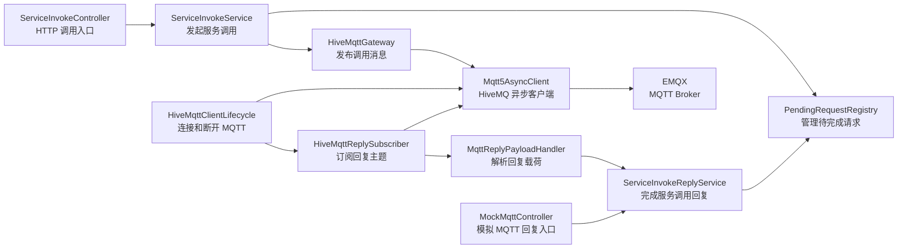
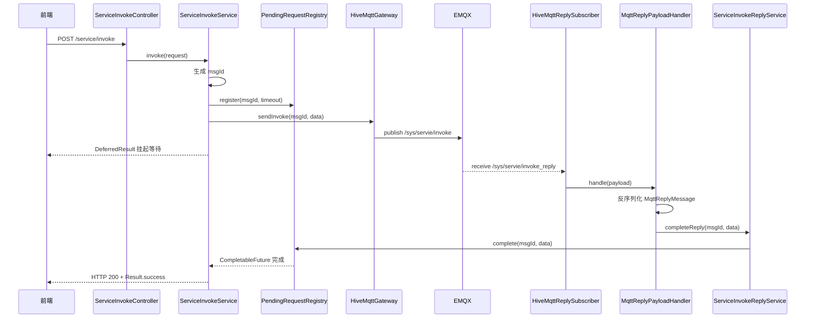

# MQTT 调用链类关系说明

本文说明当前 IoT 服务中同步 HTTP 请求、异步 MQTT 发布、MQTT 回复匹配这几类职责的边界。

## 类依赖图

## 调用时序图

## 职责说明

`PendingRequestRegistry` 是内存等待表，负责把 `msgId` 和正在等待的 HTTP 请求关联起来。它提供注册、完成、失败、取消和超时清理能力，并通过信号量限制最大 pending 数，避免无限堆积。

`ServiceInvokeService` 是 HTTP 调用发起编排服务。它生成 `msgId`，注册 pending 请求，调用 `HiveMqttGateway` 发布 MQTT 消息，并把 `CompletableFuture` 的完成结果转换成 `DeferredResult<ResponseEntity<?>>`。

`ServiceInvokeReplyService` 是回复完成服务。它不解析 MQTT，也不关心 HTTP，只负责按 `msgId` 调用 `PendingRequestRegistry.complete(...)`，因此真实 MQTT 回复和 mock 回复都可以复用它。

`HiveMqttClientLifecycle` 管理 MQTT 客户端生命周期。应用启动完成后连接 EMQX，并触发回复主题订阅；应用关闭时断开连接。

`HiveMqttGateway` 只负责发布调用消息到 `/sys/servie/invoke`。它不订阅、不解析回复，也不直接完成 HTTP 请求。

`HiveMqttReplySubscriber` 只负责订阅 `/sys/servie/invoke_reply`。收到 broker 推送后，把原始 payload 交给 `MqttReplyPayloadHandler`。

`MqttReplyPayloadHandler` 负责把 MQTT payload 反序列化为 `MqttReplyMessage`，校验 `msgId`，然后调用 `ServiceInvokeReplyService` 完成对应请求。解析失败或缺少 `msgId` 时只记录中文日志并忽略消息。

## 设计重点

- HTTP 发起链路和 MQTT 回复链路分离，避免循环依赖。
- `HiveMqttGateway` 聚焦发布，`HiveMqttReplySubscriber` 聚焦订阅。
- `ServiceInvokeReplyService` 作为统一回复入口，同时服务真实 MQTT 和 `/mock/mqtt/invoke-reply`。
- `PendingRequestRegistry` 是唯一保存 pending 状态的组件，便于后续替换为 Redis、分布式路由或其他存储。
