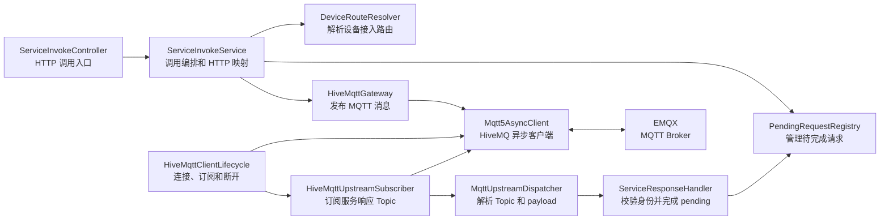
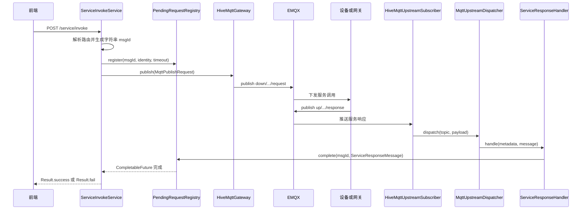

# MQTT 服务调用类关系说明

本文说明当前 IoT 服务中 HTTP 调用、MQTT 发布、MQTT 响应分发和 pending 完成的职责边界。

## 类依赖图

## 调用时序图

## 职责说明

- `ServiceInvokeService` 负责路由、消息构造、pending 注册、MQTT 发布和 HTTP 结果映射，不处理 MQTT 订阅。
- `PendingRequestRegistry` 是唯一 pending 状态持有者，负责注册、完成、失败、取消、超时和容量限制。
- `HiveMqttGateway` 只发布 `MqttPublishRequest`，不解析响应或完成 HTTP 请求。
- `HiveMqttUpstreamSubscriber` 只订阅直连设备和网关子设备的服务响应过滤器，并把原始 Topic、payload 交给分发器。
- `MqttUpstreamDispatcher` 严格解析 Topic，校验响应字段类型，并构造 `ServiceResponseMessage`。
- `ServiceResponseHandler` 对比 Topic、网关 target 与 pending 预期身份；合法响应无论成功或失败都以完整消息完成 pending。
- `HiveMqttClientLifecycle` 负责应用启动连接、订阅响应 Topic 和关闭连接。

当前不提供 mock MQTT HTTP 接口。真实 MQTT 回调和端到端测试使用同一条响应处理链。
