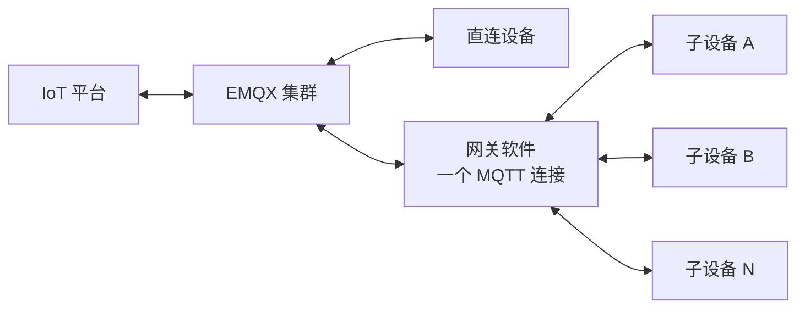
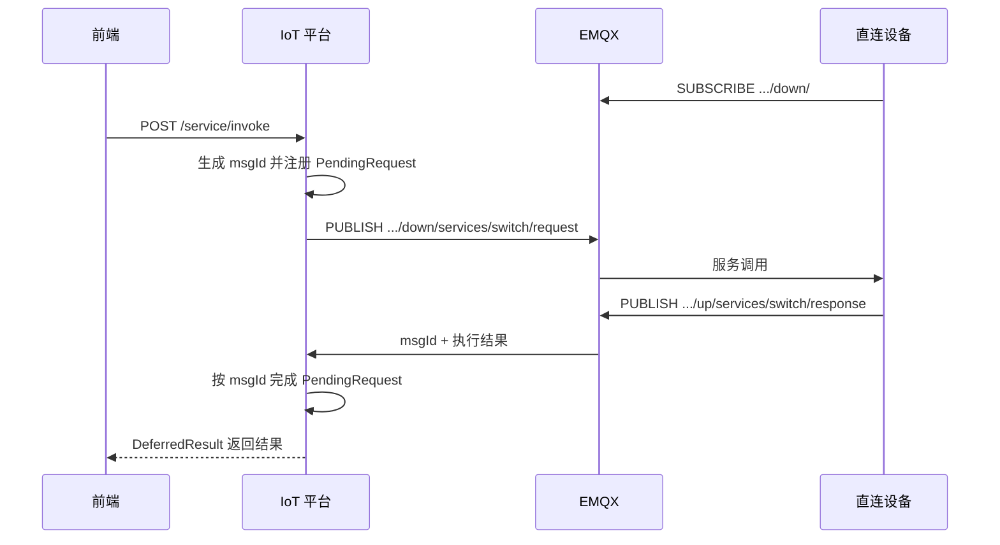
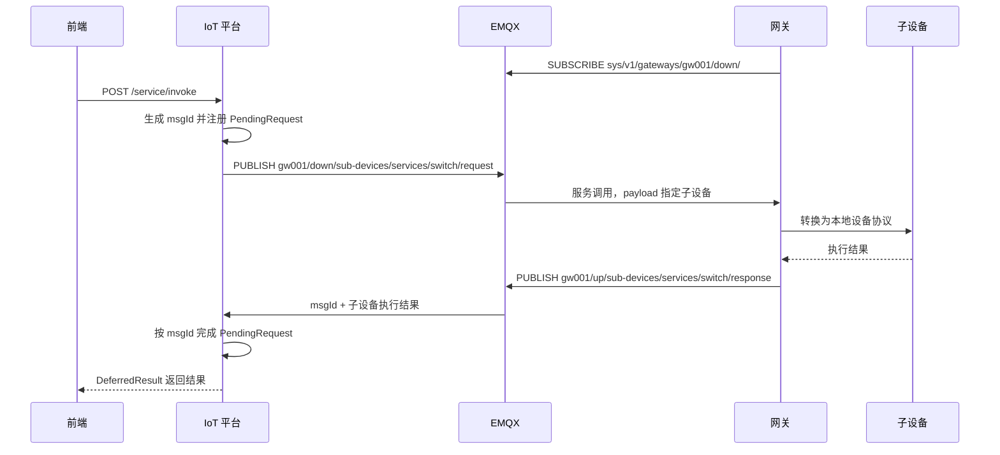
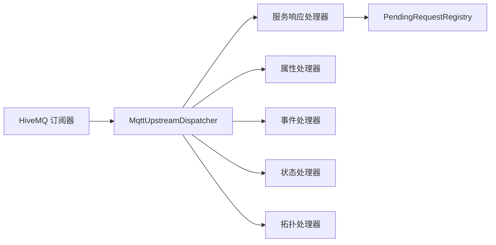

# 设备直连与网关代理接入设计

## 1. 文档目标

本文设计 IoT 平台的两种 MQTT 接入模型：

- **设备直连**：设备直接连接 EMQX，每个设备拥有独立 MQTT 会话。
- **网关代理**：只有网关软件连接 EMQX，网关管理的子设备通过本地协议与网关通信。

本文既定义主题和消息协议，也说明如何在当前 Spring Boot、HiveMQ Client、EMQX 项目中逐步实现。当前代码已经完成阶段一服务调用迁移，旧 `/sys/servie/...` 主题不再发布或订阅。

## 2. 核心设计原则

1. 连接身份与业务设备身份分离。直连设备二者相同，网关场景下 MQTT 连接身份是网关，业务身份是子设备。
2. 网关只订阅自身命名空间下的固定主题，不能随子设备数量增加订阅。
3. 主题表达路由和消息类型，业务参数、子设备身份和关联 ID 放在 payload 中。
4. MQTT 3 和 MQTT 5 共用一套业务主题。MQTT 5 的 `Response Topic`、`Correlation Data` 作为增强能力，payload 始终保留 `msgId`。
5. 所有下行命令和 QoS 1 消息必须幂等处理。
6. 主题以 `sys/v1` 开头，为后续不兼容升级预留版本。

## 3. 总体架构



设备接入协议不使用平台内部的 `deviceId`。设备只需要知道出厂或注册时获得的 `productKey` 和 `deviceCode`，平台保证二者组成全局唯一业务标识：

```text
(productKey, deviceCode) -> 全局唯一设备
```

直连设备的 `productKey` 和 `deviceCode` 从 Topic 中提取，不需要在 payload 中重复传递。网关 Topic 只包含 `gatewayId`，因此网关代理消息必须在 payload 中携带子设备的 `productKey` 和 `deviceCode`。

同一网关下允许出现相同的 `deviceCode`，只要它们属于不同的 `productKey`。例如下面两个子设备不会冲突：

```text
(light, device001)
(sensor, device001)
```

平台收到 MQTT 消息后，再根据业务标识查询内部主键并转换为统一设备消息：

```text
AccessIdentity(productKey, deviceCode)
    -> DeviceIdentityResolver
    -> PlatformDeviceIdentity(deviceId, productKey, deviceCode)

MessageMetadata(msgId, timestamp, gatewayId, messageType)
BusinessData(data)
```

`deviceId` 只在 IoT 平台内部使用，不下发给设备，也不要求设备或网关保存。设备表必须为 `(product_key, device_code)` 建立唯一索引。网关消息完成身份解析后，还必须校验该设备是否绑定到当前 `gatewayId`。上层设备管理、物模型、规则引擎和数据存储不需要关心设备是直连还是经过网关。

## 4. 主题命名约定

### 4.1 通用约定

```text
sys/v1/{连接对象}/{对象标识}/{方向}/{业务类型}
```

- `up`：设备或网关发送给平台。
- `down`：平台发送给设备或网关。
- Topic 固定路径段使用小写英文和连字符；业务标识保留注册时的大小写，并按大小写敏感处理。
- 不把 `msgId` 放入主题，避免动态主题数量持续增长。
- 业务消息默认不使用 Retain；离线、遗嘱等状态消息可按状态模型单独决定。

### 4.2 公共消息约束

MQTT payload 使用 UTF-8 编码的 JSON，Content Type 为 `application/json`。公共字段定义如下：

| 字段 | JSON 类型 | 约束 |
| --- | --- | --- |
| `msgId` | String | 消息发送方生成的唯一标识，长度 1 至 64，不允许使用 JSON Number；平台下行命令固定使用 Snowflake ID 的十进制字符串 |
| `timestamp` | Number | 消息发送时间，UTC Unix 毫秒时间戳 |
| `occurredAt` | Number | 设备侧实际发生或采集时间，UTC Unix 毫秒时间戳；没有独立发生时间时可省略 |
| `code` | Number | 业务结果码，与 HTTP Status、MQTT Reason Code 相互独立 |
| `message` | String | 结果说明；成功时为 `成功`，失败时提供可定位原因的中文描述 |
| `data` | Object | 可选的服务参数、服务结果或事件数据；消息类型定义了 `data` 但没有业务数据时使用空对象 `{}`，不返回 `null` |

协议中的 JSON Object 在 Java DTO 中统一使用 `Map<String, Object>`，包括 `ServiceInvokeRequest.data`、`ServiceInvokeResponse.data` 和 MQTT 服务请求/响应的 `data`。DTO 构造和反序列化完成后必须归一化为空 Map，业务代码不得返回或继续传递 `null`。

平台收到消息时生成内部字段 `receivedAt`，它不属于设备 payload。`timestamp` 和 `occurredAt` 与平台时间的允许偏差默认不超过 5 分钟并允许配置；超过范围时记录中文告警，涉及状态排序时使用 `receivedAt` 作为回退时间。设备时间不能用于鉴权或幂等判断。

所有 Topic 变量均禁止包含 `/`、`+`、`#` 和空字符。`productKey`、`deviceCode`、`gatewayId`、`serviceCode`、`eventCode` 长度为 1 至 64，只允许字母、数字、点、下划线和连字符。平台在拼接 Topic 前必须校验，不能直接拼接未经验证的 HTTP 参数。

基础业务结果码：

| code | 含义 |
| --- | --- |
| `20000` | 全部成功 |
| `20700` | 部分成功，仅用于包含多个处理项的响应 |
| `40000` | 请求参数或 payload 不合法 |
| `40400` | 目标设备、服务或属性不存在 |
| `40900` | 请求重复、状态冲突或拓扑关系冲突 |
| `42900` | 请求过于频繁或超过容量限制 |
| `50000` | 设备、网关或平台内部处理失败 |
| `50400` | 处理超时 |

QoS 1 消息的消费端按"发布者身份 + `msgId`"幂等，平台下行命令使用全局唯一 `msgId`。幂等记录默认保留 24 小时并允许配置。业务扩展错误码时必须登记，不能在不同处理器中复用同一个 code 表达不同含义。

### 4.3 设备直连主题

直连设备主题前缀：

```text
sys/v1/products/{productKey}/devices/{deviceCode}
```

| 方向 | 业务 | Topic |
| --- | --- | --- |
| 上行 | 属性上报 | `.../up/properties/report` |
| 上行 | 事件上报 | `.../up/events/{eventCode}/report` |
| 上行 | 服务调用响应 | `.../up/services/{serviceCode}/response` |
| 上行 | 属性设置响应 | `.../up/properties/set/response` |
| 下行 | 服务调用请求 | `.../down/services/{serviceCode}/request` |
| 下行 | 属性设置请求 | `.../down/properties/set/request` |

每台直连设备只需订阅一次：

```text
sys/v1/products/{productKey}/devices/{deviceCode}/down/#
```

### 4.4 网关代理主题

网关主题前缀：

```text
sys/v1/gateways/{gatewayId}
```

| 方向 | 业务 | Topic |
| --- | --- | --- |
| 上行 | 子设备属性上报 | `.../up/sub-devices/properties/report` |
| 上行 | 子设备事件上报 | `.../up/sub-devices/events/{eventCode}/report` |
| 上行 | 子设备状态上报 | `.../up/sub-devices/status/report` |
| 上行 | 子设备服务响应 | `.../up/sub-devices/services/{serviceCode}/response` |
| 上行 | 子设备属性设置响应 | `.../up/sub-devices/properties/set/response` |
| 上行 | 拓扑同步响应 | `.../up/sub-devices/topology/sync/response` |
| 下行 | 子设备服务调用请求 | `.../down/sub-devices/services/{serviceCode}/request` |
| 下行 | 子设备属性设置请求 | `.../down/sub-devices/properties/set/request` |
| 下行 | 子设备拓扑同步请求 | `.../down/sub-devices/topology/sync/request` |

每个网关只订阅一次：

```text
sys/v1/gateways/{gatewayId}/down/#
```

网关管理 10 台或 10 万台子设备时，云端 MQTT 连接数和网关订阅数均不增加。子设备由 payload 中的 `productKey + deviceCode` 定位。

### 4.5 属性与事件上报策略

| 接入方式 | 属性上报 | 事件上报 |
| --- | --- | --- |
| 设备直连 | 一条消息上报同一设备的多个属性 | 一条消息上报一个设备的一次事件 |
| 网关代理 | 一条消息批量上报多个子设备的多个属性 | 一条消息上报一个子设备的一次事件 |

属性适合聚合，可以显著减少网关与平台之间的 MQTT 报文数量。事件强调实时性、独立重试和准确时序，因此不使用数组批量上报。网关可以代理任意子设备上报事件，但不同子设备、不同事件必须分别发布 MQTT 消息。

## 5. 设备直连流程

### 5.1 服务调用



下行 Topic：

```text
sys/v1/products/light/devices/light001/down/services/switch/request
```

下行 payload：

```json
{
  "msgId": "124545",
  "timestamp": 1781883000000,
  "data": {
    "value": true
  }
}
```

响应 Topic：

```text
sys/v1/products/light/devices/light001/up/services/switch/response
```

响应 payload：

```json
{
  "msgId": "124545",
  "timestamp": 1781883000100,
  "code": 20000,
  "message": "成功",
  "data": {
    "value": true
  }
}
```

### 5.2 属性设置

平台发布：

```text
sys/v1/products/light/devices/light001/down/properties/set/request
```

```json
{
  "msgId": "124546",
  "timestamp": 1781883000000,
  "properties": {
    "brightness": 80,
    "colorTemperature": 4500
  }
}
```

设备处理后发布：

```text
sys/v1/products/light/devices/light001/up/properties/set/response
```

```json
{
  "msgId": "124546",
  "timestamp": 1781883000100,
  "code": 20700,
  "message": "部分成功",
  "results": [
    {
      "propertyCode": "brightness",
      "code": 20000,
      "message": "成功"
    },
    {
      "propertyCode": "colorTemperature",
      "code": 40400,
      "message": "属性不存在"
    }
  ]
}
```

`results` 必须覆盖请求中的每个属性，不允许重复 `propertyCode`。全部成功时外层 `code` 为 `20000`，部分成功时为 `20700`；全部失败且错误码相同时使用该错误码，全部失败但错误码不同时使用 `40000`，具体原因以 `results` 为准。平台通过 `msgId` 关联请求和响应。

### 5.3 属性与事件上报

属性上报：

```text
sys/v1/products/light/devices/light001/up/properties/report
```

```json
{
  "msgId": "124547",
  "timestamp": 1781883000000,
  "properties": {
    "power": true,
    "brightness": 80
  }
}
```

直连属性上报中的 `properties` 可以包含同一设备的多个属性，但不包含其他设备，也不用于一次携带多个采集时间点。

事件上报：

```text
sys/v1/products/smoke/devices/smoke001/up/events/smoke-alarm/report
```

直连事件遵循"一条消息、一个设备、一次事件"。事件类型由 Topic 中的 `eventCode` 表示，payload 不使用 `events` 数组。

```json
{
  "msgId": "124548",
  "timestamp": 1781883000000,
  "data": {
    "concentration": 91.5,
    "level": "HIGH"
  }
}
```

### 5.4 直连设备在线状态

直连设备的在线状态优先由 EMQX 连接事件判断：

- CONNECT 成功：设备在线。
- 正常 DISCONNECT：设备离线。
- 网络异常：由 Keep Alive 超时和 MQTT 遗嘱判定离线。

不建议每台设备连接后再发布一条"我已在线"消息，因为 Broker 已经掌握连接状态。平台可以通过 EMQX WebHook、规则引擎或系统事件接收连接变化。遗嘱消息用于异常断开补偿，不能替代平台的设备会话表。

平台同时维护 `lastSeenAt`，收到 CONNECT、属性、事件、服务响应等任意合法消息时更新。`lastSeenAt` 用于判断设备是否长期不活跃，但不能单独覆盖 Broker 提供的在线或离线状态，也不需要把应用层心跳伪装成属性或业务事件。

## 6. 网关代理流程

### 6.1 子设备服务调用



下行 Topic：

```text
sys/v1/gateways/gw001/down/sub-devices/services/switch/request
```

```json
{
  "msgId": "124549",
  "timestamp": 1781883000000,
  "target": {
    "productKey": "light",
    "deviceCode": "light001"
  },
  "data": {
    "value": true
  }
}
```

响应 Topic：

```text
sys/v1/gateways/gw001/up/sub-devices/services/switch/response
```

```json
{
  "msgId": "124549",
  "timestamp": 1781883000100,
  "target": {
    "productKey": "light",
    "deviceCode": "light001"
  },
  "code": 20000,
  "message": "成功",
  "data": {
    "value": true
  }
}
```

`serviceCode` 已由 Topic 表达，payload 不重复携带。平台和网关必须从 Topic 解析服务标识，并在进入业务处理前校验该服务属于目标设备的物模型。

服务调用和属性设置默认一条命令对应一台子设备。这样可以独立超时、重试和返回，不会因某一台设备故障阻塞整个批次。

### 6.2 子设备属性设置

平台发布：

```text
sys/v1/gateways/gw001/down/sub-devices/properties/set/request
```

```json
{
  "msgId": "124550",
  "timestamp": 1781883000000,
  "target": {
    "productKey": "light",
    "deviceCode": "light001"
  },
  "properties": {
    "brightness": 80,
    "colorTemperature": 4500
  }
}
```

网关处理后发布：

```text
sys/v1/gateways/gw001/up/sub-devices/properties/set/response
```

```json
{
  "msgId": "124550",
  "timestamp": 1781883000100,
  "target": {
    "productKey": "light",
    "deviceCode": "light001"
  },
  "code": 20000,
  "message": "成功",
  "results": [
    {
      "propertyCode": "brightness",
      "code": 20000,
      "message": "成功"
    },
    {
      "propertyCode": "colorTemperature",
      "code": 20000,
      "message": "成功"
    }
  ]
}
```

网关属性设置响应与直连设备使用相同的 `results` 规则，并额外携带 `target`。属性设置不做多设备批量下发，避免一台子设备失败或超时阻塞其他设备。

### 6.3 子设备批量属性上报

```text
sys/v1/gateways/gw001/up/sub-devices/properties/report
```

```json
{
  "msgId": "124551",
  "timestamp": 1781883000000,
  "devices": [
    {
      "productKey": "light",
      "deviceCode": "light001",
      "occurredAt": 1781882999000,
      "properties": {
        "power": true,
        "brightness": 80
      }
    },
    {
      "productKey": "sensor",
      "deviceCode": "sensor001",
      "occurredAt": 1781882999500,
      "properties": {
        "temperature": 25.6
      }
    }
  ]
}
```

建议每批最多 50 台设备，序列化后的 MQTT payload 不超过 256 KiB。达到任一限制立即发送，低流量时按较短时间窗口刷新，避免为了批量而增加明显延迟。

### 6.4 子设备事件上报

```text
sys/v1/gateways/gw001/up/sub-devices/events/smoke-alarm/report
```

```json
{
  "msgId": "124552",
  "timestamp": 1781883000000,
  "source": {
    "productKey": "smoke",
    "deviceCode": "smoke001"
  },
  "data": {
    "concentration": 91.5,
    "level": "HIGH"
  }
}
```

网关事件遵循"一条消息、一个子设备、一次事件"。网关可以通过同一 Topic 模式代理多个子设备，但每个子设备事件都必须独立发布；事件类型由 Topic 中的 `eventCode` 表示，payload 不重复携带 `eventCode`，也不使用 `events` 数组。

## 7. 子设备状态与批量同步模型

### 7.1 可达状态与活跃状态

子设备状态分为两个相互独立的维度，避免把"最近没有上报数据"直接解释成"设备离线"。

| 可达状态 | 含义 | 判断来源 |
| --- | --- | --- |
| `ONLINE` | 网关确认子设备当前可通信 | 网关显式上报 |
| `OFFLINE` | 网关确认子设备当前不可通信 | 网关显式上报 |
| `UNREACHABLE` | 网关离线，平台无法判断子设备真实状态 | 平台根据网关连接状态计算 |

`UNREACHABLE` 是平台根据网关连接状态计算的状态，不由网关逐台上报。这样网关断开时，平台只处理一次网关状态变化，再异步批量更新其子设备，不产生大量 MQTT 消息。

平台还为每台子设备维护以下时间：

| 字段 | 含义 |
| --- | --- |
| `lastSeenAt` | 最后一次确认子设备真实活动的时间 |
| `lastStatusAt` | 平台最后一次收到网关状态确认的 `receivedAt` |

活跃状态根据 `lastSeenAt` 计算：

| 活跃状态 | 含义 |
| --- | --- |
| `ACTIVE` | 在产品配置的活跃周期内收到过合法消息或状态确认 |
| `STALE` | 超过活跃周期仍未收到合法消息，需要进一步检查 |

属性、事件和服务响应会刷新 `lastSeenAt`。DELTA、SNAPSHOT 中所有状态项都刷新 `lastStatusAt`，只有 `ONLINE` 状态确认可以同时刷新 `lastSeenAt`；`OFFLINE` 状态不得刷新 `lastSeenAt`。`STALE` 只是辅助告警状态，不自动把可达状态改成 `OFFLINE`；低功耗设备和静默设备应按产品配置不同的活跃周期。

### 7.2 子设备状态变更的 DELTA 批量上报

网关通过本地协议、轮询或心跳判断子设备是否可通信。只有子设备可达状态发生变化时，网关才使用 DELTA 上报；多个子设备在短时间内发生变化时，应合并成一个批次：

```text
sys/v1/gateways/gw001/up/sub-devices/status/report
```

```json
{
  "msgId": "124553",
  "mode": "DELTA",
  "timestamp": 1781883000000,
  "devices": [
    {
      "productKey": "light",
      "deviceCode": "light001",
      "status": "ONLINE",
      "occurredAt": 1781882999000
    },
    {
      "productKey": "sensor",
      "deviceCode": "sensor001",
      "status": "OFFLINE",
      "occurredAt": 1781882999500
    }
  ]
}
```

DELTA 批量规则：

- `devices` 必须包含 1 至 100 台子设备，单台变化也使用相同数组结构。
- 网关使用短时间窗口或数量阈值聚合状态变化，任一条件满足即发送，不能为了凑满批次长期延迟离线通知。
- 同一批次中，同一个 `(productKey, deviceCode)` 只保留最后一次状态变化。
- 消息使用 QoS 1，平台按 `gatewayId + msgId` 幂等；重复批次不得重复触发上下线事件。
- 平台按 `occurredAt` 处理状态先后，晚到的旧状态不得覆盖较新的状态。
- 子设备的属性、事件、服务响应和 `ONLINE` 状态确认可以刷新 `lastSeenAt`，但不能替代显式的 `OFFLINE` 状态变化。

### 7.3 SNAPSHOT 全量批量同步

网关首次连接或断线重连后，应分批发送完整状态快照：

```json
{
  "msgId": "124554",
  "mode": "SNAPSHOT",
  "syncId": "sync-20260619-001",
  "batchIndex": 1,
  "batchCount": 10,
  "timestamp": 1781883000000,
  "devices": [
    {
      "productKey": "light",
      "deviceCode": "light001",
      "status": "ONLINE",
      "occurredAt": 1781882999000
    },
    {
      "productKey": "sensor",
      "deviceCode": "sensor001",
      "status": "OFFLINE",
      "occurredAt": 1781882999500
    }
  ]
}
```

每个 SNAPSHOT 批次的 `devices` 同样包含 1 至 100 台子设备。最后一个批次不足 100 台时按实际数量发送，不发送空批次。

平台只有在同一 `syncId` 的所有批次完整到达后才执行最终对账，`batchIndex` 从 1 开始且不能大于 `batchCount`。平台按 `gatewayId + syncId + batchIndex` 幂等；对账时所有状态项更新 `lastStatusAt`，只有 `ONLINE` 状态项可以更新 `lastSeenAt`。

第一阶段不实现 SNAPSHOT 分片确认和自动重传。平台在 30 秒内未收到全部批次时，丢弃本次不完整快照、保持原状态并记录中文告警和监控指标；网关在下一次周期同步或重连时使用新的 `syncId` 重新发送完整快照。分片确认、缺失批次重传和断点续传放入后续版本。

### 7.4 心跳与超时处理

- MQTT Keep Alive 只用于判断直连设备或网关与 Broker 的连接状态。
- 子设备心跳由网关在本地消化，平台不要求每次心跳都转发为 MQTT 消息。
- 心跳导致子设备状态发生变化时，网关通过 DELTA 批量上报。
- 网关在线但子设备长期没有任何有效数据时，平台将活跃状态标记为 `STALE`，不直接标记为 `OFFLINE`。
- 网关离线时，其全部子设备统一进入 `UNREACHABLE`；网关重连后通过分批 SNAPSHOT 恢复准确状态。

### 7.5 子设备拓扑全量同步

平台需要核对网关当前管理的子设备清单时，向网关发送全量同步请求：

```text
sys/v1/gateways/gw001/down/sub-devices/topology/sync/request
```

```json
{
  "msgId": "124555",
  "timestamp": 1781883000000,
  "mode": "FULL"
}
```

网关使用一个或多个响应批次返回当前完整拓扑：

```text
sys/v1/gateways/gw001/up/sub-devices/topology/sync/response
```

```json
{
  "msgId": "124555",
  "timestamp": 1781883000100,
  "syncId": "topology-20260620-001",
  "batchIndex": 1,
  "batchCount": 2,
  "code": 20000,
  "message": "成功",
  "devices": [
    {
      "productKey": "light",
      "deviceCode": "light001"
    },
    {
      "productKey": "sensor",
      "deviceCode": "sensor001"
    }
  ]
}
```

拓扑同步规则：

- `msgId` 必须与平台请求一致；同一次同步的所有响应批次使用相同的 `msgId` 和 `syncId`。
- `batchIndex` 从 1 开始，每批最多 100 台子设备。
- 网关没有子设备时发送一个批次：`batchIndex=1`、`batchCount=1`、`devices=[]`。
- 平台按 `gatewayId + msgId + syncId + batchIndex` 幂等，所有批次完整后才更新拓扑关系。
- 拓扑响应是多消息流，不进入只支持单响应的 `PendingRequestRegistry`，由独立拓扑同步处理器聚合。
- 网关无法执行同步时只发送一个失败响应：`batchIndex=1`、`batchCount=1`、`devices=[]`，并通过 `code` 和 `message` 说明原因。
- 第一阶段不实现缺失批次自动重传；30 秒内未完整接收时丢弃本次同步并记录告警，后续由平台重新发起一次完整同步。

## 8. MQTT 3 与 MQTT 5 兼容

两种协议使用同一套主题和 JSON payload：

- MQTT 3 客户端通过响应 Topic 和 payload 中的 `msgId` 关联请求。
- MQTT 5 请求可以额外设置 `Response Topic` 和 `Correlation Data`。
- MQTT 5 响应方优先发布到请求携带的 `Response Topic`，并原样返回 `Correlation Data`。
- 为兼容 MQTT 3、消息落库和故障排查，MQTT 5 消息仍必须保留 payload 中的 `msgId`。
- `Correlation Data` 固定为 `msgId` 的 UTF-8 字节，不使用 Java 二进制序列化。
- 设备或网关只能接受落在自身上行 ACL 范围内、且与当前业务响应类型一致的 `Response Topic`，不能向未经校验的任意 Topic 发布。

第一阶段 MQTT 5 仍使用固定业务响应 Topic，不为每个请求或平台节点生成动态 Topic。例如：

```text
sys/v1/products/light/devices/light001/up/services/switch/response
sys/v1/gateways/gw001/up/sub-devices/services/switch/response
```

固定响应 Topic 与 MQTT 3 完全一致，`Response Topic` 只是向 MQTT 5 客户端明确回复地址，真正的请求关联仍以 payload 中的字符串 `msgId` 为准。

## 9. 安全与 ACL

### 9.1 直连设备

设备凭证绑定 `productKey + deviceCode`，只允许：

```text
PUBLISH   sys/v1/products/{自己的productKey}/devices/{自己的deviceCode}/up/#
SUBSCRIBE sys/v1/products/{自己的productKey}/devices/{自己的deviceCode}/down/#
```

### 9.2 网关

网关凭证绑定全局唯一 `gatewayId`，只允许：

```text
PUBLISH   sys/v1/gateways/{自己的gatewayId}/up/#
SUBSCRIBE sys/v1/gateways/{自己的gatewayId}/down/#
```

平台必须校验 payload 中的子设备确实属于当前网关，不能仅依赖 MQTT Topic ACL。子设备拓扑变更应经过注册、绑定、解绑流程，并保留审计记录。

生产环境还应启用 TLS、限制单条消息大小、限制发布速率，并对认证失败、越权 Topic 和异常流量记录中文上下文日志。

## 10. 在当前项目中的实现方案

### 10.1 当前基线

当前项目已经具备同步 HTTP 转异步 MQTT 的最小闭环：

```text
ServiceInvokeController
  -> ServiceInvokeService
      -> DeviceRouteResolver
      -> PendingRequestRegistry
      -> HiveMqttGateway

HiveMqttUpstreamSubscriber
  -> MqttUpstreamDispatcher
      -> ServiceResponseHandler
          -> PendingRequestRegistry
```

以下约束继续保留：

- `ServiceInvokeController.invoke` 返回 `DeferredResult<ResponseEntity<?>>`。
- `ServiceInvokeService.invoke` 返回 `DeferredResult<ResponseEntity<?>>`。
- 后台生成 Snowflake ID，并在 DTO、JSON 和 `PendingRequestRegistry` 中统一使用字符串 `msgId`。
- `PendingRequestRegistry` 继续负责注册、完成、失败、取消和超时清理。
- `PendingRequest` 使用 `CompletableFuture<ServiceResponseMessage>` 保存完整设备响应，不再只保存字符串 `data`。
- `PendingRequest` 同时保存预期的设备身份、接入路由和 `serviceCode`，用于校验响应来源。
- 成功和失败响应继续使用 micro-service 的 `Result`。

### 10.2 下一阶段开发范围

下一阶段只实现新 Topic 下的服务调用闭环，避免一次引入属性、事件、状态、拓扑和分布式路由：

**包含：**

- 增加统一 Topic 常量、构建器、解析器和服务响应订阅分发。
- `/service/invoke` 支持直连设备和网关子设备两种目标。
- 将 `msgId` 从 `long/Long` 迁移为 Snowflake 十进制字符串。
- 将 HTTP 和 MQTT 服务调用的 `data` 迁移为非空 `Map<String, Object>`。
- 增加配置驱动的 `InMemoryDeviceRouteResolver`，支持本地直连和网关路由联调。
- 发布直连或网关服务请求，接收服务响应并完成原有 `DeferredResult<ResponseEntity<?>>`。
- 按 MQTT 响应 `code/message/data` 生成成功或失败 HTTP 结果。
- 保留 30 秒 HTTP 等待超时、pending 上限、未知响应和重复响应处理。
- 更新 mock reply，使其能模拟直连和网关服务响应。

**不包含：**

- 属性设置、属性上报、事件上报、状态同步和拓扑同步的 Java 实现。
- 数据库、设备注册、物模型和真实拓扑存储；运行时使用 `iot.routing.devices` 内存配置，服务单元测试可以 mock `DeviceRouteResolver`。
- SNAPSHOT 或拓扑分片自动重传。
- IoT 服务多节点部署和分布式 pending 路由。
- EMQX 连接事件 WebHook、TLS 和生产 ACL 配置。

只有本阶段验收通过后，才进入下一阶段，不能同时铺开后续处理器。

### 10.3 请求模型扩展

现有 `/service/invoke` 只有 `data`，后续需要补充目标设备信息：

```json
{
  "productKey": "light",
  "deviceCode": "light001",
  "serviceCode": "switch",
  "data": {
    "value": true
  }
}
```

字段约束：

- `productKey`、`deviceCode`、`serviceCode` 始终必填。
- `data` 必须是 JSON Object，Java 类型固定为 `Map<String, Object>`；没有参数时使用空 Map，并序列化为 `{}`。
- `msgId` 不允许前端传入，仍由服务端生成。
- `targetType` 和 `gatewayId` 不允许前端传入。平台根据 `(productKey, deviceCode)` 查询设备路由，得到 `DIRECT_DEVICE` 或 `GATEWAY_SUB_DEVICE`；网关子设备的 `gatewayId` 由平台拓扑关系解析。
- 设备不存在、未绑定网关或当前路由不可用时，在发布 MQTT 前返回对应错误，不能信任调用方提供的路由信息。

#### 开发期设备路由

阶段一没有数据库，新增 `DeviceRouteProperties` 读取本地配置，并由 `InMemoryDeviceRouteResolver` 构建只读路由索引：

```yaml
iot:
  routing:
    devices:
      - product-key: light
        device-code: light001
        access-type: DIRECT_DEVICE
      - product-key: sensor
        device-code: sensor001
        access-type: GATEWAY_SUB_DEVICE
        gateway-id: gw001
```

路由规则：

- 索引 key 为 `(productKey, deviceCode)`，启动时发现重复配置应立即终止启动并记录中文错误日志。
- `DIRECT_DEVICE` 不允许配置 `gatewayId`；`GATEWAY_SUB_DEVICE` 必须配置 `gatewayId`。
- 找不到设备时抛出 `HttpStatus4xxException(40400, "目标设备不存在")`。
- 网关子设备缺少或存在无效 `gatewayId` 时抛出 `HttpStatus4xxException(40900, "设备网关路由无效")`。
- `DeviceRouteResolver` 定义为接口，阶段一使用内存实现；测试可以直接 mock，后续数据库实现不改变 `ServiceInvokeService`。

### 10.4 Topic 解析与发布

新增统一主题组件，避免在业务代码中拼接字符串：

```text
MqttTopicResolver
  directServiceRequest(productKey, deviceCode, serviceCode)
  directServiceResponse(productKey, deviceCode, serviceCode)
  directServiceResponseFilter()
  gatewayServiceRequest(gatewayId, serviceCode)
  gatewayServiceResponse(gatewayId, serviceCode)
  gatewayServiceResponseFilter()
  parse(topic) -> MqttTopicMetadata
```

`MqttTopicMetadata` 至少包含 `accessType`、`direction`、`messageType`、`productKey`、`deviceCode`、`gatewayId`、`serviceCode` 和 `eventCode`。不适用于当前 Topic 的字段使用空字符串；解析结果不得使用未经校验的原始 Topic 片段。Topic 层级数量错误、固定路径段错误或变量不合法时，解析返回明确失败结果或抛出统一协议异常，不能返回部分解析对象。

`ServiceInvokeService` 先调用 `DeviceRouteResolver` 获取设备接入类型和 `gatewayId`，再选择 Topic、构造统一调用消息并交给发布组件。发布请求统一封装为 `MqttPublishRequest`，包含 `topic`、`responseTopic`、`correlationData` 和 `payload`；`correlationData` 使用字符串 `msgId` 的 UTF-8 字节。`HiveMqttGateway.publish(MqttPublishRequest)` 只负责序列化、设置 QoS/MQTT 5 属性和调用 HiveMQ Client，不参与业务路由。

`PendingRequest` 必须保存预期的设备身份和 `serviceCode`，响应的 Topic 身份与 pending 不一致时拒绝完成请求。

服务响应转换为 HTTP 的规则固定如下：

- MQTT 响应 `code=20000`：返回 HTTP 200，body 为 `Result.success(ServiceInvokeResponse)`，其中 `ServiceInvokeResponse.data` 使用响应中的 Map。
- MQTT 响应 `code!=20000`：使用 `CommonUtil.getResponseStatus(code)` 计算 HTTP Status，body 为 `Result.fail(code, message)`。
- MQTT 响应缺少 `msgId`、`code` 或必要身份字段：记录包含 Topic 和 payload 上下文的中文日志并忽略。
- Topic 身份、payload 中的网关子设备身份与 pending 预期身份不一致：记录越权或错配日志并忽略。
- 被忽略的消息不能完成或失败 pending，原 HTTP 请求继续等待其他合法响应，直到正常完成或 30 秒超时。

### 10.5 上行订阅与消息分发

完整协议最终需要以下通配符。下一阶段只启用两个服务响应订阅，其余订阅随对应处理器完成后逐步开启，不能先订阅再丢弃消息：

```text
sys/v1/products/+/devices/+/up/services/+/response
sys/v1/products/+/devices/+/up/properties/set/response
sys/v1/products/+/devices/+/up/properties/report
sys/v1/products/+/devices/+/up/events/+/report
sys/v1/gateways/+/up/sub-devices/services/+/response
sys/v1/gateways/+/up/sub-devices/properties/set/response
sys/v1/gateways/+/up/sub-devices/properties/report
sys/v1/gateways/+/up/sub-devices/events/+/report
sys/v1/gateways/+/up/sub-devices/status/report
sys/v1/gateways/+/up/sub-devices/topology/sync/response
```

收到消息后的处理链：



分发器根据实际 Topic 匹配消息类型，不包含业务处理。网关消息还必须校验 Topic 中的 `gatewayId` 与平台拓扑关系。`MqttUpstreamDispatcher.dispatch(topic, payloadBytes)` 返回 `MqttDispatchResult`，包含字符串 `msgId` 和 `matched`；真实 MQTT callback 忽略返回值，单元测试使用返回值断言分发结果。无法解析 `msgId` 时返回空字符串和 `matched=false`，不得返回 `null`。

### 10.6 真实 MQTT 联调

阶段一不保留 `/mock/mqtt/invoke-reply`。自动化联调由 `EndToEndInvokeTest` 启动随机端口的 IoT 服务，并使用真实 HiveMQ MQTT 客户端模拟直连设备和网关：

```text
HTTP /service/invoke
  -> IoT 服务发布 request Topic
  -> 模拟设备或网关订阅 down/# 并发布 response Topic
  -> IoT 服务真实订阅、解析和身份校验
  -> 完成原 DeferredResult
```

测试中的平台 MQTT 客户端和模拟设备客户端必须使用同一次测试运行生成的唯一 Client ID，避免与已启动的 IoT 服务或并发测试互相踢下线。非法 Topic、payload 或身份不匹配的响应由分发器忽略，pending 继续等待合法响应或超时。

### 10.7 现有类迁移清单

阶段一按以下关系迁移，迁移完成后删除旧实现，不保留两套并行处理链：

| 当前类或方法 | 阶段一处理 |
| --- | --- |
| `MqttTopics.INVOKE_TOPIC/INVOKE_REPLY_TOPIC` | 替换为新协议固定路径段、Topic 构建和过滤规则 |
| `HiveMqttGateway.sendInvoke(MqttInvokeMessage)` | 替换为 `HiveMqttGateway.publish(MqttPublishRequest)` |
| `HiveMqttReplySubscriber` | 替换为订阅两个服务响应过滤器的 `HiveMqttUpstreamSubscriber` |
| `MqttReplyPayloadHandler` | 拆分为 `MqttUpstreamDispatcher` 和 `ServiceResponseHandler` |
| `MqttInvokeMessage` | 替换为 `DirectServiceRequestMessage`、`GatewayServiceRequestMessage` |
| `MqttReplyMessage` | 替换为 `ServiceResponseMessage` |
| `ServiceInvokeReplyService` | 由 `ServiceResponseHandler` 承担响应校验和完成 pending 的职责后删除 |
| `PendingRequestRegistry<Long, String>` 语义 | 改为字符串 key，并以 `ServiceResponseMessage` 完成 future |
| `MsgIdGenerator.nextId()` | 返回 Snowflake ID 的十进制字符串 |
| `MockMqttController` | 删除，端到端测试改用真实 MQTT 模拟设备和网关 |

`HiveMqttClientLifecycle` 连接成功后订阅直连和网关两个服务响应过滤器；任一订阅失败都视为启动 MQTT 消费链失败并记录中文异常日志。断线重连后必须恢复两个订阅。

### 10.8 DTO 建议

新增 DTO 应继续遵循项目规范，实现 `Serializable` 并包含 `serialVersionUID`：

```text
DeviceIdentity
DeviceRoute
MqttMessageMetadata
MqttTopicMetadata
MqttPublishRequest
DirectServiceRequestMessage
GatewayServiceRequestMessage
ServiceResponseMessage
MockMqttMessageRequest
MqttDispatchResult
PropertySetRequestMessage
PropertySetResponseMessage
PropertyResult
GatewayPropertyBatchMessage
GatewayEventReportMessage
GatewayStatusBatchMessage
GatewayStatusItem
GatewayTopologySyncRequestMessage
GatewayTopologyBatchMessage
```

DTO 使用 Lombok，public 类和方法添加中文 JavaDoc。反序列化继续使用 `ObjectMapperUtil`，日志和异常上下文使用中文。

阶段一 DTO 中所有 `msgId` 使用 `String`，所有 JSON Object 类型的 `data` 或 `payload` 使用 `Map<String, Object>` 并归一化为空 Map。`MqttTopicMetadata` 中不适用的字符串字段使用空字符串，不返回 `null`。

### 10.9 后续多节点部署

当前 `PendingRequestRegistry` 是单机内存结构，因此下一阶段只支持单个 IoT 服务节点。多节点部署明确放入后续版本，不在当前代码中预埋动态节点响应 Topic。

后续优先评估 Redis 分布式 pending 和节点通知方案，使设备仍发布到本协议定义的固定业务响应 Topic，不扩大设备或网关 ACL。按节点动态响应 Topic 仅作为备选方案，启用前必须另行设计 ACL、订阅恢复和节点下线处理。

平台普通属性、事件、状态消费可以使用 EMQX 共享订阅水平扩展；HTTP 等待型服务响应不能直接随机共享消费，否则无法命中本节点内存中的 `PendingRequestRegistry`。

## 11. 性能建议

- 每个直连设备保持一个连接、一个 `down/#` 订阅。
- 每个网关保持一个连接、一个 `down/#` 订阅，禁止按子设备逐个订阅。
- DELTA 和 SNAPSHOT 状态批次包含 1 至 100 台子设备，属性批次默认不超过 50 台，单包不超过 256 KiB。
- 命令、设置、响应和状态建议 QoS 1；高频且可容忍少量丢失的遥测数据可使用 QoS 0。
- QoS 1 普通上行按"发布者身份 + `msgId`"幂等；平台服务请求使用全局唯一 `msgId`，重复响应不得重复完成 HTTP 请求。
- 网关使用有界队列聚合上报，队列满时执行明确的降级或落盘策略，不能无限占用内存。
- 网关重连后对订阅、状态快照和待发送消息增加抖动，避免大量网关同时冲击平台。
- 平台端使用共享订阅、规则引擎或消息队列扩展普通上行消费，服务调用响应采用定向路由。
- 对连接数、订阅数、消息速率、批次大小、处理延迟、未知 `msgId` 和超时率建立监控。

## 12. 厂商方案参考

### 阿里云

阿里云使用网关 Topic 管理子设备，子设备身份放在 payload 中，并提供批量上下线接口。批量上下线单次最多 50 台，一个网关最多同时在线 2,000 台子设备。

- [阿里云：子设备上下线](https://help.aliyun.com/zh/iot/user-guide/connect-or-disconnect-sub-devices)

### 华为云 IoTDA

华为云通过网关事件 Topic 批量更新子设备状态，`device_statuses` 一次可包含 1 至 100 台设备；同时提供网关批量上报子设备属性的能力。

- [华为云：网关更新子设备状态](https://support.huaweicloud.com/intl/en-us/api-iothub/iot_06_v5_3022.html)
- [华为云：网关批量上报子设备属性](https://support.huaweicloud.com/intl/en-us/api-iothub/iot_06_v5_7011.html)

### AWS Greengrass

AWS IoT Core 为直连客户端发布 CONNECT 和 DISCONNECT 生命周期事件，连接状态由云端根据 MQTT 会话判断。AWS Greengrass 使用边缘 MQTT Broker 和 MQTT Bridge；子设备先连接本地 Broker，Bridge 使用 `+`、`#` 通配符把匹配的消息映射到 AWS IoT Core，避免为每台设备单独配置云端订阅。

- [AWS IoT Core：连接生命周期事件](https://docs.aws.amazon.com/iot/latest/developerguide/life-cycle-events.html)
- [AWS IoT Greengrass：MQTT Bridge](https://docs.aws.amazon.com/greengrass/v2/developerguide/mqtt-bridge-component.html)
- [AWS IoT Greengrass：连接客户端设备](https://docs.aws.amazon.com/greengrass/v2/developerguide/connect-client-devices.html)

## 13. 推荐实施顺序

### 阶段一：服务调用协议迁移

1. 将 `msgId` 从 `long/Long` 迁移为字符串，并更新 pending、DTO、mock 和测试。
2. 增加 Topic 构建、解析和变量校验组件。
3. 跑通直连设备服务调用。
4. 增加 `gatewayId + target` 路由和拓扑校验接口，跑通网关子设备服务调用。
5. 新协议联调通过后，停用 `/sys/servie/invoke` 和 `/sys/servie/invoke_reply`，不做新旧 Topic 双发。

### 阶段二：属性与事件

1. 实现直连设备和网关子设备属性设置及逐属性结果。
2. 实现直连属性上报和网关批量属性上报。
3. 实现直连和网关事件上报，保持一条消息对应一次事件。

### 阶段三：状态与拓扑

1. 定义 `DeviceStateStore` 和 `DeviceTopologyStore` 接口，先提供内存实现，数据库实现后续替换。
2. 实现 DELTA、SNAPSHOT、`lastSeenAt`、`lastStatusAt` 和 `ACTIVE/STALE` 计算。
3. 实现拓扑全量同步和批次聚合，不实现缺失批次自动重传。

### 阶段四：生产接入能力

1. 选定并实现 EMQX 连接事件接入方式，建立 MQTT `clientId` 与设备或网关身份的映射。
2. 增加持久化、TLS、ACL、限流、审计和监控。
3. 进行批量消息、重连风暴和长连接压力测试。

### 后续版本

- SNAPSHOT 和拓扑同步的分片确认、缺失批次重传及断点续传。
- Redis 分布式 pending、节点通知和 IoT 服务多节点部署。
- EMQX 集群故障切换及跨区域容灾。

## 14. 阶段一验收标准

### 14.1 自动化测试

- `MqttTopicResolver` 能正确构建和解析直连、网关服务请求及响应 Topic。
- Topic 变量为空、超长或包含 `/`、`+`、`#` 时拒绝处理。
- 后台生成字符串 `msgId`，HTTP 请求不能传入；超过 JavaScript 安全整数范围的 Snowflake ID 经过 JSON 序列化和反序列化后保持完全一致。
- `ServiceInvokeRequest.data`、MQTT 请求/响应 `data` 和 `ServiceInvokeResponse.data` 均支持嵌套 JSON Object；缺省值归一化为空 Map，不出现 `null`。
- `DeviceRouteProperties` 能加载直连和网关路由；重复设备、直连设备携带 `gatewayId`、网关设备缺少 `gatewayId` 时启动失败。
- `DeviceRouteResolver` 对已配置设备返回正确路由，对未知设备和无效网关路由返回文档定义的框架异常。
- 直连调用发布到目标设备服务请求 Topic，合法响应能够按 `msgId` 完成原 HTTP 请求。
- 网关调用由 `DeviceRouteResolver` 解析目标网关，发布到该网关 Topic，payload 包含 `target.productKey + target.deviceCode`，且必须通过拓扑校验。
- 非法 Topic、Topic 与 payload 身份不匹配、未知 `msgId` 和重复响应不会完成其他 pending 请求。
- MQTT `code=20000` 返回 HTTP 200 和 `Result.success`；非 `20000` 使用 `CommonUtil.getResponseStatus(code)` 并返回 `Result.fail(code, message)`。
- 真实 MQTT 端到端测试经过 Topic 解析、payload 校验、身份校验和服务响应处理链。
- MQTT 生命周期连接成功后订阅两个服务响应过滤器，订阅失败和断线重连恢复订阅均有测试覆盖。
- MQTT 发布失败返回现有发送失败结果；30 秒未收到响应返回 HTTP 504 和 `Result.fail(50400, "等待 MQTT 回复超时")`。
- MVC 测试继续断言 `ServiceInvokeController.invoke` 和 `ServiceInvokeService.invoke` 使用 `DeferredResult<ResponseEntity<?>>`。
- 单元测试使用 mock MQTT Client；`EndToEndInvokeTest` 明确依赖真实 EMQX，并使用唯一 Client ID 隔离连接。

### 14.2 手动联调

1. 执行 `mvn test`，所有测试通过。
2. 在 `iot.routing.devices` 配置一台直连设备和一台网关子设备，启动 EMQX 和 IoT 服务，确认平台完成两个服务响应 Topic 的订阅。
3. 模拟配置中的直连设备订阅自身 `down/#`，使用嵌套 JSON `data` 完成一次 `/service/invoke` 请求和响应。
4. 模拟配置中的网关订阅自身 `down/#`，根据 `target` 找到子设备并完成一次请求和响应。
5. 分别验证正常响应、设备失败响应、未知 `msgId`、重复响应和 30 秒超时。
6. 确认生产 MQTT 流程不再发布或订阅 `/sys/servie/invoke`、`/sys/servie/invoke_reply`。

阶段一的全部自动化测试和手动联调完成后，才能开始阶段二。

## 15. Codex 审核记录

### 15.1 审核结论

服务调用主链路设计正确：HTTP 请求由平台生成字符串 `msgId`，根据设备路由发布到直连设备或网关 Topic；平台订阅服务响应，通过 Topic 身份、网关子设备身份和 pending 预期值完成原 `DeferredResult<ResponseEntity<?>>`。

本次审核发现并修复了测试 Client ID 冲突、Topic 解析过宽、响应 payload 校验不足、失败响应丢失完整消息等问题。不恢复 `/mock/mqtt/invoke-reply`，真实 MQTT 是唯一端到端测试路径。

### 15.2 已修复问题

1. `EndToEndInvokeTest` 为平台客户端和模拟设备客户端增加同一次运行共享的随机标识，避免与已启动服务或并发测试互相踢下线。
2. Topic 解析改为精确匹配层级和方向：`up` 只接受 `response/report`，`down` 只接受 `request`；多余层级、未知业务路径和方向错配全部返回 `valid=false`。
3. 服务响应要求 `msgId` 为非空字符串、`timestamp` 为正整数、`code` 为整数。`data` 缺省时归一化为空 Map，类型不是 JSON Object 时拒绝。
4. 网关服务响应要求 `target.productKey` 和 `target.deviceCode` 为合法非空字符串，并继续与 pending 中的网关和子设备身份进行比对。
5. 响应时间与平台时间偏差超过 5 分钟时记录中文警告，但不影响当前 pending 的业务关联。
6. 合法的非 `20000` 响应使用完整 `ServiceResponseMessage` 完成 pending，由 `ServiceInvokeService` 统一转换为 HTTP Status 和 `Result.fail(code, message)`。
7. 端到端测试只保留直连调用、网关调用、设备失败、设备不存在和等待超时。属性、事件、状态及拓扑当前只测试 Topic 构建和解析，不宣称已实现平台处理链。
8. 删除旧 `/sys/servie/...` 主题常量，并更新 `AGENTS.md` 的架构说明。

### 15.3 审核验收标准

- `ServiceInvokeController.invoke` 和 `ServiceInvokeService.invoke` 继续返回 `DeferredResult<ResponseEntity<?>>`。
- 直连和网关服务调用成功时返回 HTTP 200 与完整嵌套 `data`。
- 设备业务失败、设备不存在、MQTT 发布失败和 30 秒超时保持现有响应协议。
- 非法 Topic 或 payload 不得完成或失败 pending，原请求继续等待合法响应或超时。
- 执行 `mvn clean test` 时全部测试通过。
- IoT 服务运行期间执行测试，不得因 MQTT Client ID 重复导致服务或测试客户端掉线。

### 15.4 后续范围

属性设置、属性上报、事件上报、状态同步、拓扑同步、跨节点 pending 路由和消息幂等存储仍按主设计文档后续阶段实施。
