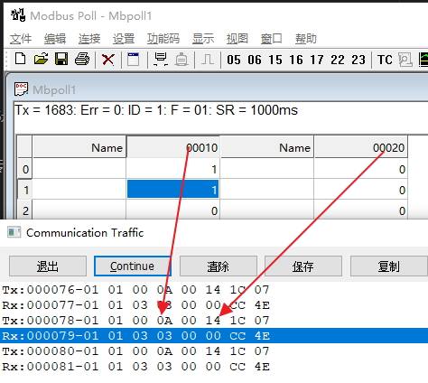
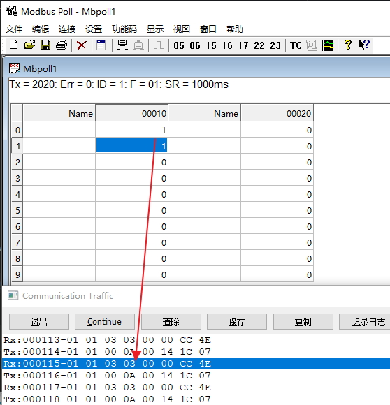
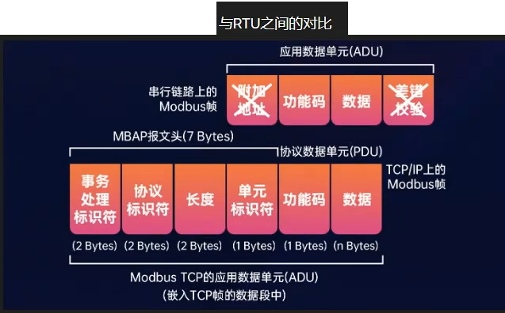
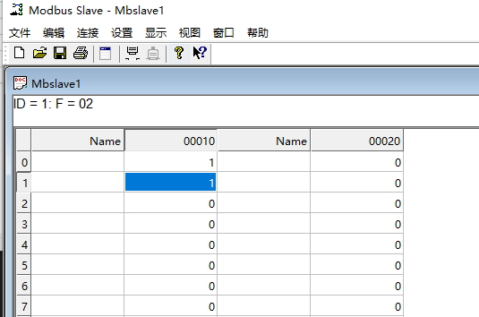
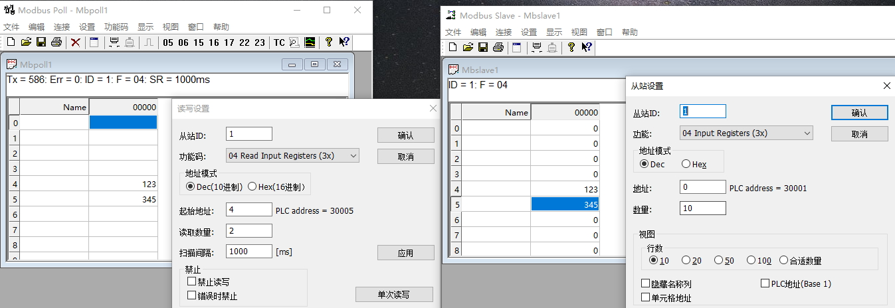

# 存储区
    输出线圈 0
        地址：00001 ~ 09999
    输入线圈 1
        地址：10001 ~ 19999
    输入寄存器 3
        地址：30001 ~ 39999
    输出寄存器 4
        地址：40001 ~ 49999
    存储区范围：5位和6位 标准地址 拓展地址
        如果是6位的存储区，每个存储区最大地址是65536，则线圈、寄存器的地址分别是
            000001 ~ 065536
            100001 ~ 165536
            300001 ~ 365536
            400001 ~ 465536

# 读写功能码
    读写           功能码

    读输出线圈       01
    读输入线圈       02
    读输出寄存器     03
    读输入寄存器     04 
    写单个输出线圈    05
    写单个输出寄存器  06
    写多个输出线圈    15
    写多个输出寄存器  16

# 工具
    mbpoll，模拟Modbus主站（如PLC、SCADA系统），用于测试和调试从设备（如传感器、执行器）。
    mbslave，模拟Modbus从站（如设备、仪表）

# ModbusRTU协议

通用报文格式：从站地址（设备编码）+ 功能码 + 数据 + 校验

    ModbusRTU
        从站地址：1字节
        功能码：1字节
        数据：可变长度
        校验：2字节（CRC16校验）

## 01H功能码读取输出线圈
    
    发送报文格式：从站地址（设备编码）+ 功能码 + 开始线圈 + 线圈数量 + CRC
    接收报文格式：从站地址（设备编码）+ 功能码 + 字节计数 + 数据 + CRC

### 数据解析

Tx:000078-01 01 00 0A 00 14 1C 07

Tx表示发送，000042-不用理会，

01表示从站地址

01表示功能码，读取输出线圈

00 0A表示开始线圈。开始线圈是00010，也就是10，10转16进制是A，开始线圈占2字节，所以是00 0A

00 14表示线圈数量。读取的线圈数量是20，转为16进制是14，线圈数量占2字节，所以是00 14

1C 07表示CRC校验

Rx:000079-01 01 03 03 00 00 CC 4E

Rx表示接受报文，000043-不用理会，

01表示从站地址

01表示功能码，读取输出线圈

03表示字节计数，线圈数量是20，一个字节是8，两个字节是16，20得用3个字节表示，所以是03

03 00 00 表示数据。第一个字节是0000 0011，所以是03，总共20个线圈，但后面的都是0，所以是00 00

CC 4E 表示CRC校验

## 02H功能码读取输入线圈
    报文格式与“01H功能码读取输出线圈”相同，只是功能码为02
    输入线圈只能通过slave改数据，不能通过Modbus poll改数据

# ModbusTCP协议
## 通信格式说明
    MBAP报文头，7字节
        事务标识符，2字节。报文ID，不参与运算
        协议标识符，2字节。固定为00 00
        长度，2字节。     长度之后总共的字节数
        单元标识符，1字节。相当于ModbusRTU的从站地址
    功能码，1字节
    数据部分，可变长度

### ModbusTCP与RTU之间的关系
    校验：
        ModbusTCP一般是基于TCP/UDP，在传输层已经有了校验，不需要在应用层再做校验
    站地址：
        ModbusTCP弱化了站地址的概念，因为在以太网中，可通过IP地址确定一个设备。
        但为了保守起见，还是保留了站地址，可使用单元标识符表示站地址。
        在实际应用中，可以使用单元标识符表示站地址，也可以不使用单元标识符表示站地址。
        如果忽略单元标识符，则单元标识符默认为1
    
## 02功能码读取输入线圈
    发送报文格式：事务标识符 + 协议标识符 + 长度 + 单元标识符 + 功能码 + 线圈地址 + 长度
    返回报文格式：事务标识符 + 协议标识符 + 长度 + 单元标识符 + 功能码 + 字节计数 + 数据

### 例子：读取1号站点从10开始的20个线圈的值

Tx:000102-02 D8 00 00 00 06 01 02 00 0A 00 14
    
    Tx表示发送，000102-不用理会
    02 D8：事务标识符，自增
    00 00：协议标识符
    00 06：长度，06后面的数据是6字节，所以是06
    01：单元标识符，忽略单元标识符，则单元标识符默认为1
    02：功能码，02功能码读取输入线圈
    00 0A：线圈地址，从00010开始读取，所以是00 0A
    00 14：读取的线圈数量，20个，转为16进制是14，所以是00 14

Rx:000103-02 D8 00 00 00 06 01 02 03 03 00 00

    Rx表示接收数据，000103-不用理会
    02 D8：事务标识符，自增
    00 00：协议标识符
    00 06：长度，06后面的数据是6字节，所以是06
    01：单元标识符，忽略单元标识符，则单元标识符默认为1
    02：功能码，02功能码读取输入线圈
    03：字节计数，读20个线圈，一个字节是8，两个字节是16，20得用3个字节表示，所以是03
    03 00 00：数据，输入线圈的值。第一个字节是0000 0011，所以是03，总共20个线圈，但后面的都是0，所以是00 00

## 04功能码读取输入寄存器
    发送报文格式：事务标识符 + 协议标识符 + 长度 + 单元标识符 + 功能码 + 寄存器地址 + 长度
    返回报文格式：事务标识符 + 协议标识符 + 长度 + 单元标识符 + 功能码 + 字节计数 + 数据

### 例子：读取1号站点从4开始的2个寄存器的值

Tx:001020-03 48 00 00 00 06 01 04 00 04 00 02

    Tx表示发送，001020-不用理会
    03 48：事务标识符，自增
    00 00：协议标识符
    00 06：长度，06后面的数据是6字节，所以是06
    01：单元标识符，忽略单元标识符，则单元标识符默认为1
    04：功能码，04功能码读取输入寄存器
    00 04：寄存器地址，从起始地址4开始读取
    00 02：长度，读取数量是2寄存器

Rx:001021-03 48 00 00 00 07 01 04 04 00 7B 01 59

    Rx表示接收数据，001021-不用理会
    03 48：事务标识符，自增
    00 00：协议标识符
    00 07：长度，07后面的数据是6字节，所以是06
    01：单元标识符，忽略单元标识符，则单元标识符默认为1
    04：功能码，04功能码读取输入寄存器
    04：字节计数，读取两个寄存器，一个字节是8，两个字节是16，所以是04
    00 7B 01 59：十六进制007B转十进制是123，0159转十进制是345

