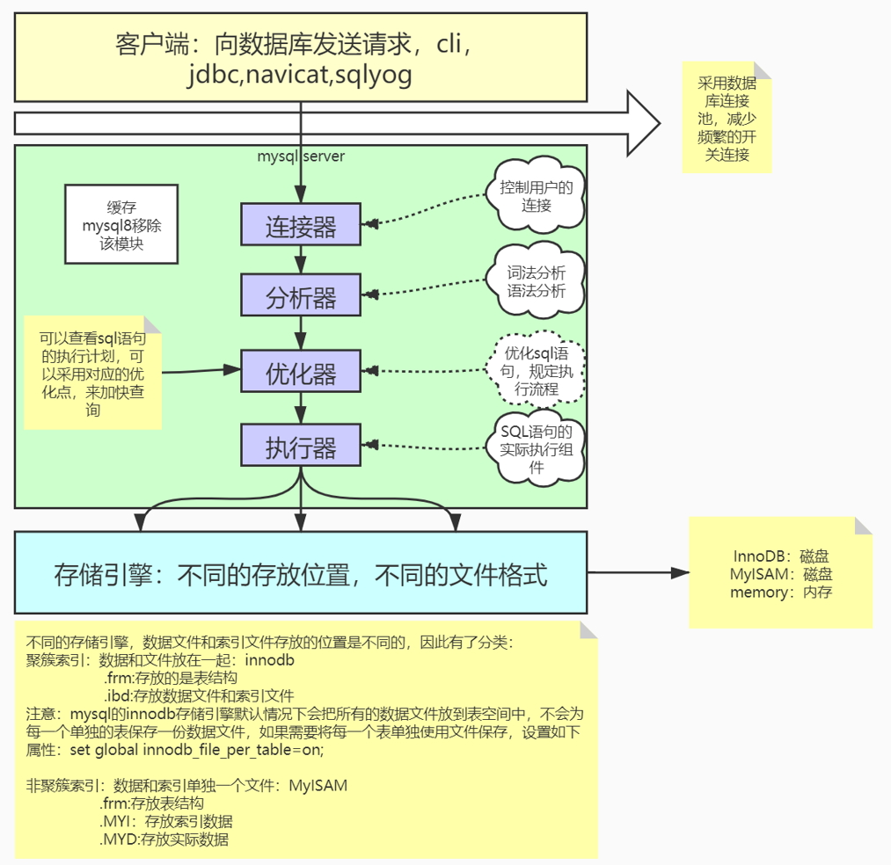
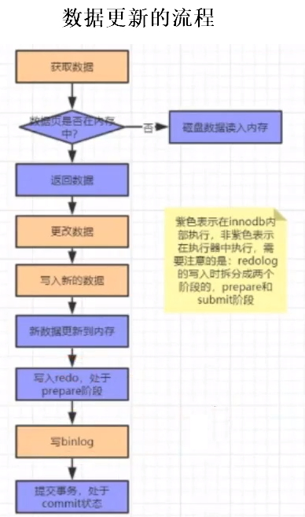
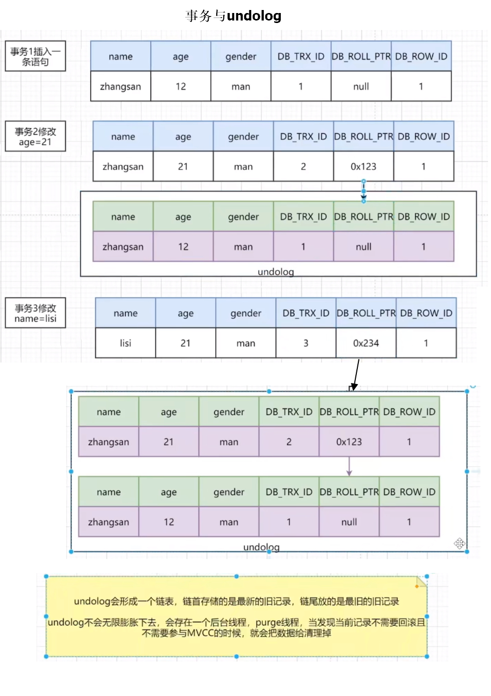
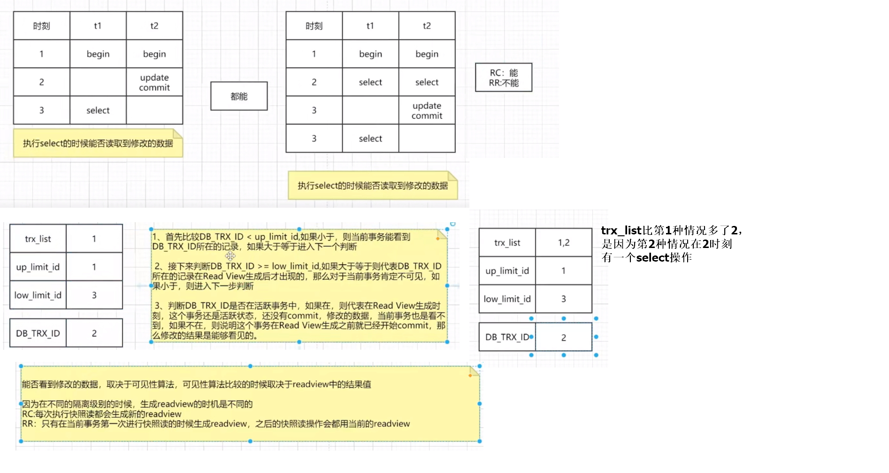
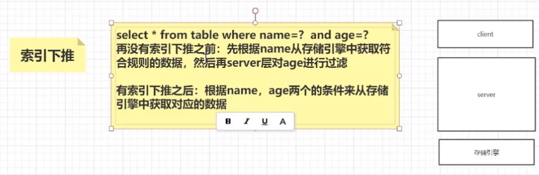

# 索引
1、mysql的索引数据、实际数据都存储在磁盘，MySQL启动时会把索引文件加载到内存  
2、当进行查询的时候，需要将磁盘中的数据读取到内存中  
3、将磁盘的索引数据加载到内存，并不是一次性把所有的索引数据都加载到内存，而是分块进行数据读取，读取页的整数倍    
    分块读取涉及到“局部性原理”  
    时间局部性：之前被访问过的数据，有可能很快被再次访问 
    空间局部性：数据和程序都有聚集成群的倾向，具备某些特征的数据可以放在一起  
    磁盘预读：内存跟磁盘在进行交互的时候，有一个最基本的逻辑单位称为页，也叫datapage，大小一般是4K或者8K，我们在进行数据读取的时候，一般读取的是页的整数倍  
4、内存中使用B+树这种数据结构存储索引

数据迁移时，可以先删除索引，迁移完成后再建立索引。不然迁移过程中，索引一直在修改，性能低。

索引不是越多越好：
1、索引维护会非常麻烦
2、占用的存储空间变大，会导致IO增多

B+树索引的叶子节点存放什么：
    主键（不太精准）
    在innodb存储引擎中，数据在进行插入的时候需要跟某一个索引列绑定在一起，
    这个索引列如果有主键，使用主键
    如果没有主键，使用唯一键
    如果没有唯一键，使用6字节rowid

回表：B+树的叶子节点存储索引字段真实值、主键ID。查找到叶子节点后，再通过主键ID查找整行数据，这叫做回表操作。可使用索引覆盖避免回表

索引覆盖：叶子节点包含了全部要查询的字段，效率高。查询计划的Extra字段会显示 Using index

聚簇索引：数据和索引绑定在一起的叫做聚簇索引

非聚簇索引：数据跟索引分开存储的叫做非聚簇索引

innodb数据文件有两种类型：
    .frm 储存表结构
    .idb 储存表数据和索引数据

表字段是否适合创建索引？
    非相同值个数/全部值个数 > 80% 适合键索引，Boolean类型不适合创建索引

mysql架构

前缀索引：对字段前面的几个字符、字节做索引
https://www.cnblogs.com/studyzy/p/4310653.html
https://opensource.actionsky.com/20210120-mysql/
前缀索引优点：能有效减少索引文件的大小，提高索引的速度
前缀索引缺点：MySQL不能在 ORDER BY、GROUP BY 中使用前缀索引，也不能把他们用作覆盖索引。

语法：ALTER TABLE table_name ADD KEY(column_name(前缀个数));

-- 对account建立前缀索引

-- 计算account字段 前3个字符不重复个数 与 全部字符不重复个数 的比值
SELECT 1.0*COUNT(DISTINCT LEFT(account, 3))/COUNT(*) FROM `person_info_large`;

-- 计算account字段 前4个字符不重复个数 与 全部字符不重复个数 的比值
SELECT 1.0*COUNT(DISTINCT LEFT(account, 4))/COUNT(*) FROM `person_info_large`;

-- 比值与使用前4个字符相差不大，所以可以选择使用前4个字符建立前缀索引
SELECT 1.0*COUNT(DISTINCT LEFT(account, 5))/COUNT(*) FROM `person_info_large`;

-- 添加前缀索引
ALTER TABLE person_info_large ADD KEY(account(4));

# 集群
主从架构 
1、Master节点将数据写入 Binary log
2、Slave节点通过 I/O thread 拉取 Master的Binary log，将 Binary log 写入 Relay log（也叫中继日志）
3、SQL thread 读取 Relay log，将数据写入 Slave db，这一步也叫“重放”。
其他的步骤都是顺序IO，因为 Binary log、Relay log都只有一个文件。
将数据写入 Slave db 是随机IO，因为数据库的db文件有很多份，这一步可能会有性能问题。
4、MySQL-5.7之后可以使用MTS提高性能
    使用“组提交”

分库分表的基本思想是“分而治之”，表中一般带有分片字段，SQL语句都带上分片字段，如果查询SQL没有带上分片字段，则会轮询所有的数据库。

# 事务
ACID
原子性：要么全部成功，要么全部失败。使用 Undo Log 实现。
隔离性：使用 MVCC、锁
持久性：使用 redolog、WAL、write ahead log预写日志
一致性：原子性、隔离性、持久性 的实现最终保证了 一致性

Undo Log是为了实现事务的原子性，在MySQL数据库Innodb存储引擎中，还用Undo Log来实现多版本并发控制机制（简称MVCC）
在操作任何数据之前，首先将数据备份到一个地方（这个存储数据备份的地方称为Undo Log），然后进行数据的修改。如果出现了错误或者用户执行了rollback语句，系统可以利用Undo Log中的备份数据恢复到事务开始之前的状态
注意：Undo Log是逻辑日志，可以理解为：
    当delete一条记录时，undo log中会记录一条对应的insert记录
    当insert一条记录时，undo log中会记录一条对应的delete记录
    当update一条记录时，undo log中会记录一条相反的update记录

WAL：实际的数据没有写成功，但是只要日志存在，就可以根据日志恢复数据

binlog：属于 MySQL server

undolog、redolog：属于MySQL innodb

数据更新的流程

执行流程：
1、执行器先在引擎中找到数据，如果在内存中则直接返回
    如果不在内存中，查找磁盘数据，将磁盘数据加载到内存，返回数据
2、执行器拿到数据之后会先修改数据，然后调用引擎接口重新写入数据
3、引擎将数据更新到内存，同时写数据到redo中，此时处于prepare阶段，并通过执行器执行完成，随时可以操作
4、执行器生成这个操作的binlog
5、执行器调用引擎的事物提交接口，引擎把刚刚写完的redo改成commit状态，更新完成。

binlog、redolog都存储新数据，存在双写问题，这是有历史原因的，最开始MySQL使用MyISAM引擎。innodb只是第三方引擎插件，innodb本身就自带了redolog

innodb解决双写问题的方式：
1、redolog的数据有prepare、commit两种状态。
2、数据写入redolog，数据是prepare状态
3、数据写入binlog
4、提交事务，然后把redolog的数据改成commit状态

如果在第2步后断电，MySQL重启后，发现redolog有数据，但是binlog没数据，则不会重放redolog的数据
如果在第3步后断电，MySQL重启后，发现redolog有数据，但是binlog也有数据，则会重放redolog的数据

隔离性：读未提交、读已提交/RC、可重复读（默认）/RR、串行化

隔离性越高效率越低

# MVCC
MVCC：多版本并发控制，解决数据并发读写问题

快照读：读取的是MySQL对应数据的历史版本数据
    select
当前读：读取的是最新的数据结果
    select lock in share mode
    select for update
    insert
    delete
    update

MVCC多版本并发控制指的是维持一个数据的多个版本，使得读写操作没有冲突。
快照读是MySQL为了实现MVCC的一种非阻塞读功能

实现原理：
    1、隐藏字段：
        DB_TRX_UD：最近修改事物ID。记录创建当前记录或者最后一个修改的事物ID
        DB_ROLL_PTR：回滚指针。指向这条记录的上一个版本
        DB_ROW_ID：隐藏主键。是一个64字节的字段

undolog：回滚日志。记录之前数据的历史版本

事务与undolog 

readview：当事物在进行快照读的时候，会生成一个读视图来进行可见性判断，可见性判断是由可见性算法来确定的。
    trx_list：当前系统活跃的事物ID，可以认为是没提交的操作
    up_limit_id：活跃事物列表中最小的ID值
    low_limit_id：当前系统尚未分配的下一个事物ID

readview与可见性算法 

在客户端执行
begin
select * from tableName
update tableName set xxx=xxx
select * from tableName
两条select的查询结果可能不一致，因为其他客户端可能改了数据，而本客户端的update语句会导致readview重建，导致两次select查询结果不一致，这就是幻读

读取的时候加锁可以解决幻读。例如
begin
select * from tableName where xx=xx for update
--事务中使用 select ... for update 后，其他客户端执行修改操作时，会被阻塞，直到本事务结束
update tableName set xxx=xxx
select * from tableName

在RC隔离级别下，是每个快照读都会生成并获取最新的ReadVIew，在RR隔离级别下，这是在同一个事务的第一个快照读才会创建Read View，之后的快照读获取的是同一个Read View

索引下推

MySQL的索引下推，MySQL-5.7之后对联合索引查询的优化
假设有联合索引（name, age）
select * from tb_user where name like '张%' and age <= 10;
非索引下推：联合索引查询所有满足name以‘张’开头的索引，然后回表查询出所有的响应的全行数据，然后再筛选出年龄小于等于10的用户数据。
索引下推：查询所有满足名称以‘张’开头的索引，然后筛选出年龄小于等于10的索引，最后再回表查询全行数据。
使用索引下推能减少回表查询的数据量

通过修改系统变量 optimizer_switch 的 index_condition_pushdown 来控制
关闭索引下推
set optimizer_switch='index_condition_pushdown=off'
