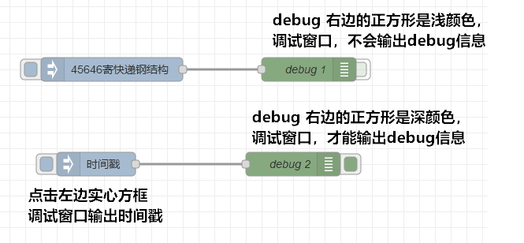
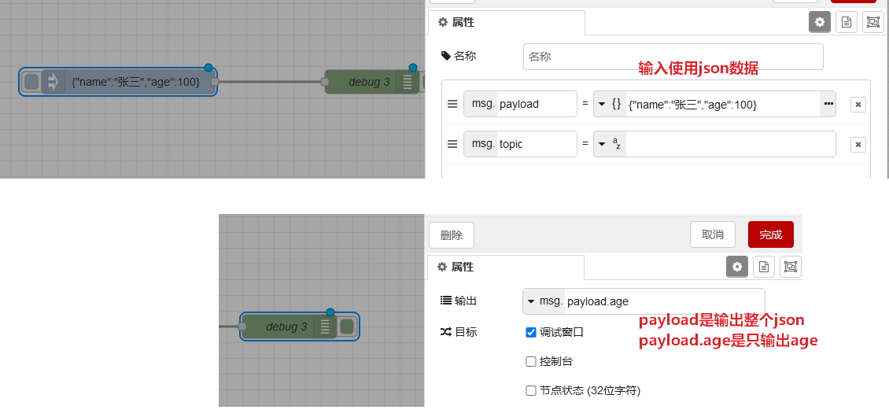
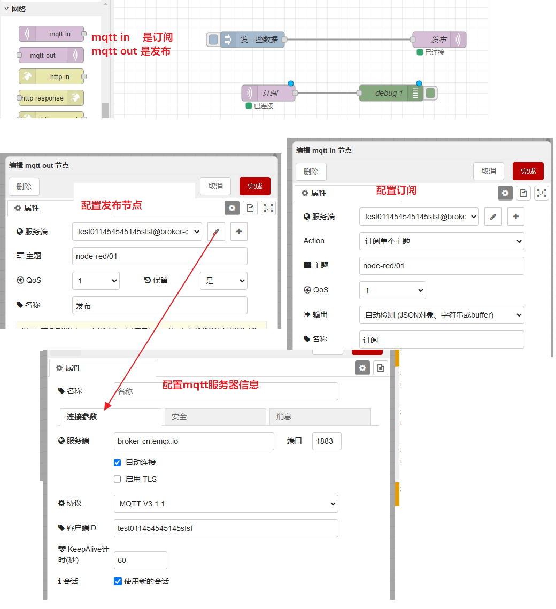
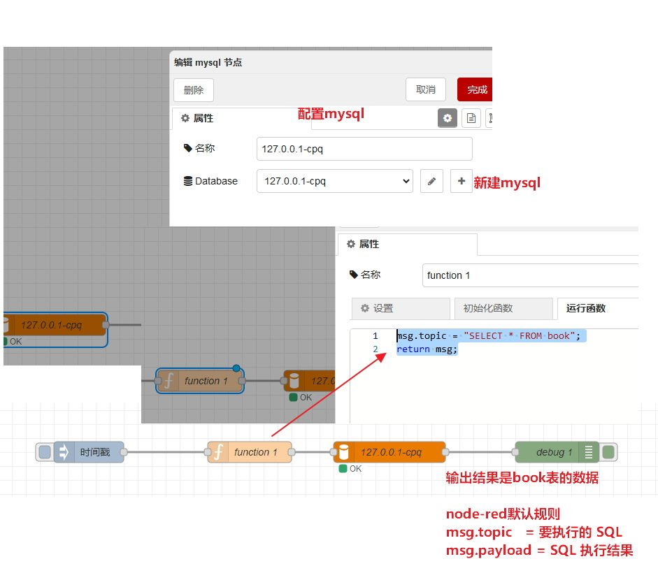
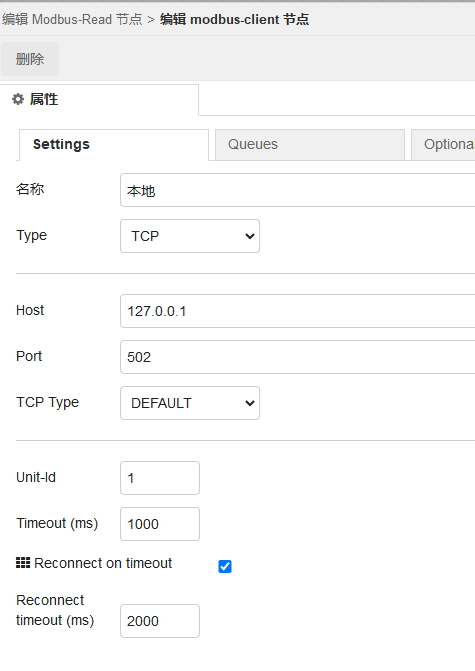
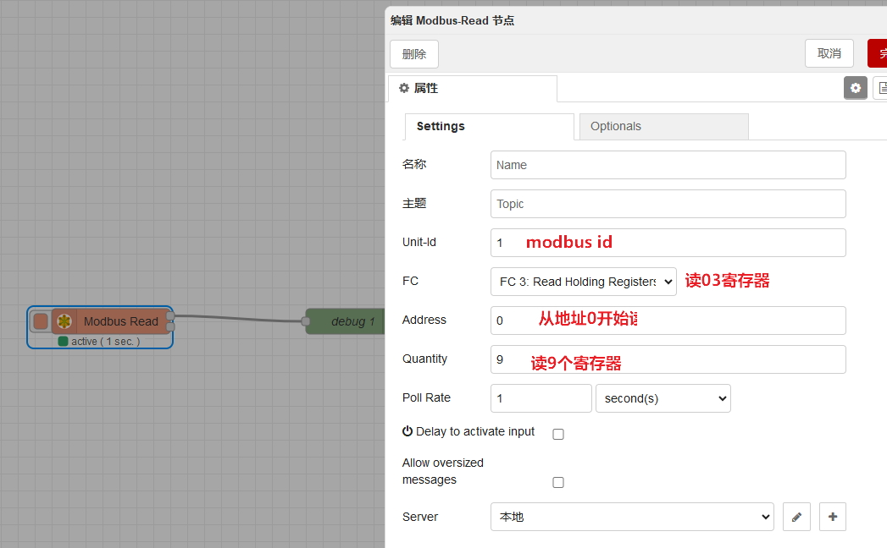

# window安装node-red

~~npm install -g --unsafe-perm node-red pm2 pm2-windows-startup pm2-windows-service~~

npm install -g node-red

启动

node-red

系统地址

http://127.0.0.1:1880/

# 使用
输出调试信息 



使用json数据



使用mqtt



## 安装 MySQL 节点

Node-RED 默认不带 MySQL 节点，需要手动安装 `node-red-node-mysql`。

### 在 Node-RED 页面安装

1. 打开 Node-RED 页面。
2. 点击右上角菜单 `☰`。
3. 选择 `节点管理`。
4. 切换到 `安装` 页签。
5. 搜索以下节点：

   ```text
   node-red-node-mysql
   ```

6. 点击 `安装`。
7. 安装完成后刷新页面，左侧节点栏会出现 `mysql` 节点，通常在 `存储` 分类里。

### 使用mysql


## modbus
安装 node-red-contrib-modbus

modbus地址配置



modbus读



## node-red-contrib-loop
安装node-red-contrib-loop

